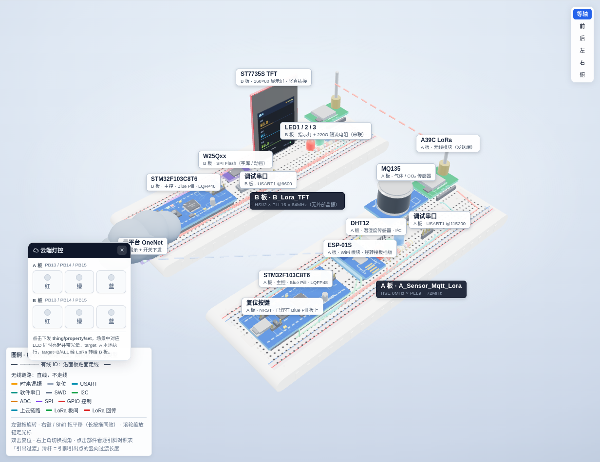
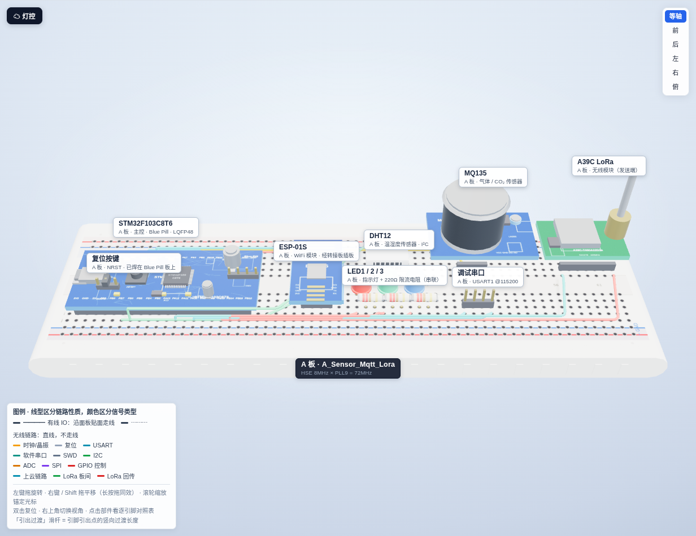
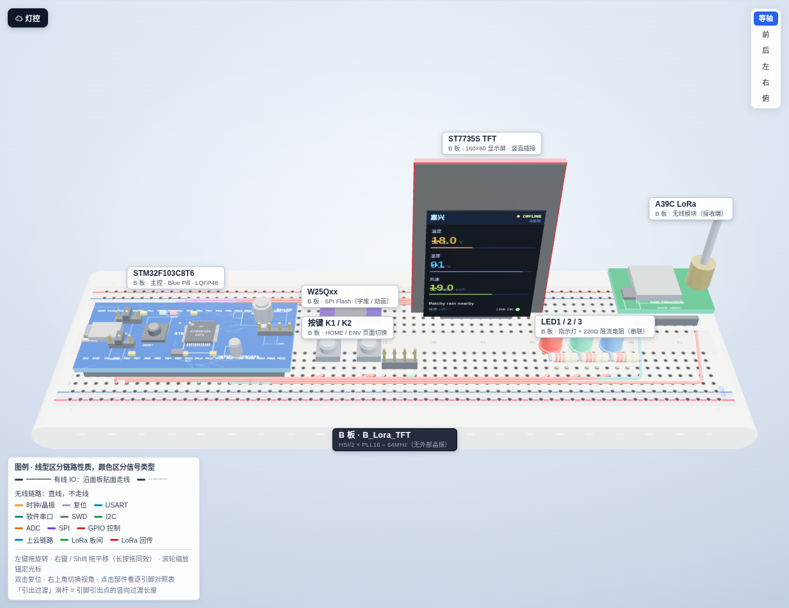

# STM32 ESP8266 LoRa IoT Environment Monitor

这是一个基于 STM32F103C8T6 的双节点环境监测实训项目。A 节点负责采集温湿度与空气质量数据，并通过 ESP8266 接入 OneNet MQTT；B 节点通过 LoRa 串口接收数据，并在 0.96 inch 160x80 SPI TFT 上显示。

项目包含两个独立 Keil 工程：

| 节点 | 工程目录 | 作用 |
| --- | --- | --- |
| A 节点 | `A_Sensor_Mqtt_Lora/` | DHTC12 + MQ135 采集、ESP8266 MQTT 上云、LoRa/软串口发送 |
| B 节点 | `B_Lora_TFT/` | A39C LoRa 接收、环境数据解析、ST7735S TFT 显示、W25Qxx 字库/动画 |

## Features

- STM32F103C8T6 + HAL 裸机主循环实现。
- DHTC12 I2C 温湿度读取，带 CRC 校验和异常回退。
- MQ135 ADC 采样与 CO2 趋势估算，适合教学展示和环境趋势观察。
- ESP8266 AT 指令接入 WiFi，并以 MQTT 协议连接 OneNet。
- A/B 节点之间使用 `$T=xx,H=xx,C=xx#` 环境帧传输。
- B 节点支持 ST7735S 160x80 TFT 显示、W25Qxx 字库和开机动画。
- 已加入独立看门狗 IWDG 与 fault 自动复位，降低死机后长期卡死风险。
- Keil MDK-ARM 工程可直接打开编译。

## Repository Layout

```text
.
├── A_Sensor_Mqtt_Lora/
│   ├── Core/Inc/              # A 节点头文件、OneNet 配置、传感器接口
│   ├── Core/Src/              # A 节点业务代码和驱动实现
│   ├── Drivers/               # CMSIS + STM32F1 HAL
│   ├── MDK-ARM/               # Keil 工程 GetTemp_Hum.uvprojx
│   └── README.md              # A 节点详细说明
├── B_Lora_TFT/
│   ├── Assets/boot_anim.bin   # TFT 开机动画资源
│   ├── Core/Inc/              # B 节点显示、帧解析、W25Qxx 接口
│   ├── Core/Src/              # B 节点主程序和驱动实现
│   ├── Drivers/               # CMSIS + STM32F1 HAL
│   ├── MDK-ARM/               # Keil 工程 OLED_Stm32_W25QXX.uvprojx
│   └── README.md              # B 节点详细说明
├── docs/
│   ├── index.html             # 3D 实物布线模型（单文件，离线可开）
│   └── img/                   # 模型截图
└── tests/
    └── test_led_protocol.c    # 主机侧协议解析测试
```

## Hardware

### A 节点

| 模块 | STM32F103C8T6 引脚 | 说明 |
| --- | --- | --- |
| DHTC12 SCL | PB6 / I2C1_SCL | I2C 时钟 |
| DHTC12 SDA | PB7 / I2C1_SDA | I2C 数据 |
| MQ135 AO | PB0 / ADC1_IN8 | 建议经 2:1 分压进入 3.3V ADC |
| ESP8266 TX/RX | USART2 | AT 指令通信 |
| Debug UART | PA9 / PA10 / USART1 | 115200 8N1 |
| LoRa TX | 软串口输出 | 向 B 节点发送环境帧 |

### B 节点

| 模块 | STM32F103C8T6 引脚 | 说明 |
| --- | --- | --- |
| TFT SCL | PA5 / SPI1_SCK | ST7735S SPI 时钟 |
| TFT SDA | PA7 / SPI1_MOSI | ST7735S SPI 数据 |
| TFT CS | PA4 | 片选 |
| TFT DC | PB0 | 数据/命令选择 |
| TFT RES | PB1 | 复位 |
| W25Qxx CLK/DI/DO | PA5 / PA7 / PA6 | 与 TFT 共用 SPI1 |
| W25Qxx CS | PA3 | 独立片选 |
| A39C LoRa RX | PA12 | 软串口接收 |
| Debug UART | USART1 | 串口诊断输出 |

> 上面两张是按模块归并的摘要；覆盖全部 36 条连线、带源码行号的完整对照表在下面的「逐引脚对照总表」。

## 3D 实物布线模型

仓库里带一份单文件、离线可开的 3D 实物布线模型（`docs/index.html`，Three.js 内联，无外部依赖）：**一根线 = 一个真实 IO 口**，点击任意部件会高亮它的全部连线，并在 LQFP48 封装上点亮对应脚位。

- 在线交互：<https://zhanglove2003.github.io/MyStm32_Esp8266project/>
- 或下载后直接双击 `docs/index.html`。不需要联网也能完整使用，只有 TFT 屏上的天气会回落到离线估算并标注 `OFFLINE`。



| A 板 · 采集 + 上云 + 发送 | B 板 · 接收 + 本地显示 |
| --- | --- |
|  |  |

## 逐引脚对照总表

下面 36 条连线逐条对照过源码，「源码依据」一列给出文件名与行号，脚位为 LQFP48 封装第几脚。B 板的连线数多于引脚数，是因为 TFT 与 W25Qxx 共用同一组 SPI1 总线，SCK / MISO / MOSI 三根线各算两条。

#### A 板 · A_Sensor_Mqtt_Lora

Keil target `GetTemp_Hum` · HSE 8MHz × PLL9 = 72MHz · 16 条连线 · 16 个 IO 口

| 模块 | 引脚 | 脚位 | 信号 | 说明 | 源码依据 |
| --- | --- | --- | --- | --- | --- |
| ESP-01S | `PA0` | #10 | ESP_EN | GPIO 推挽输出<br>ESP8266 复位时序：拉低 250ms → 拉高 → 延时 1s | `esp8266.c:179-181` |
| ESP-01S | `PA2` | #12 | USART2_TX | USART2_TX @115200<br>AT 指令与 TCP 数据的发送端 | `usart.c:72 · esp8266.c:63` |
| ESP-01S | `PA3` | #13 | USART2_RX | USART2_RX @115200<br>+IPD 下行与 AT 回显的接收端（中断 RX） | `usart.c:77 · esp8266.c:19` |
| 调试串口 | `PA9` | #30 | USART1_TX | USART1_TX @115200<br>调试日志输出 | `usart.c:57` |
| 调试串口 | `PA10` | #31 | USART1_RX | USART1_RX @115200<br>调试口接收（未使用） | `usart.c:62` |
| A39C LoRa | `PA12` | #33 | 软串口 TX | GPIO 推挽输出（软件 UART）<br>软件模拟 UART，SOFT_UART_BAUD = 9600 | `soft_uart_tx.c:5-9` |
| MQ135 | `PB0` | #18 | ADC1_IN8 | 模拟输入 ADC1_IN8<br>气敏电阻分压采样，R0 校准后拟合 CO₂ | `gpio.c:62 · adc.c:22` |
| DHT12 | `PB6` | #42 | I2C1_SCL | I2C1 时钟 @100kHz<br>DHTC12 温湿度读取 | `i2c.c:67,86` |
| DHT12 | `PB7` | #43 | I2C1_SDA | I2C1 数据 @100kHz<br>DHTC12 温湿度读取 | `i2c.c:67,86` |
| A39C LoRa | `PB12` | #25 | A39C_AUX | GPIO 上拉输入<br>模块忙标志；发送前阻塞等待其变高 | `soft_uart_tx.c:7-8,81-84` |
| LED1 / 2 / 3 | `PB13` | #26 | LED1 | GPIO 推挽输出<br>高电平点亮；上电全灭 | `led_control.c:7` |
| LED1 / 2 / 3 | `PB14` | #27 | LED2 | GPIO 推挽输出<br>高电平点亮；上电全灭 | `led_control.c:8` |
| LED1 / 2 / 3 | `PB15` | #28 | LED3 | GPIO 推挽输出<br>高电平点亮；上电全灭 | `led_control.c:9` |
| 8MHz 晶振 | `PD0` | #5 | OSC_IN | HSE 输入<br>8MHz 晶振，PLL×9 得 72MHz | `GetTemp_Hum.ioc PD0-OSC_IN` |
| 8MHz 晶振 | `PD1` | #6 | OSC_OUT | HSE 输出<br>8MHz 晶振，PLL×9 得 72MHz | `GetTemp_Hum.ioc PD1-OSC_OUT` |
| 复位按键 | `NRST` | #7 | NRST | 复位<br>按下拉低复位 | `—（标准复位电路）` |

#### B 板 · B_Lora_TFT

Keil target `OLED_Stm32_W25QXX` · HSI/2 × PLL16 = 64MHz（无外部晶振） · 20 条连线 · 17 个 IO 口

| 模块 | 引脚 | 脚位 | 信号 | 说明 | 源码依据 |
| --- | --- | --- | --- | --- | --- |
| W25Qxx | `PA3` | #13 | W25QXX_CS | GPIO 推挽输出（片选）<br>SPI Flash 片选，低有效 | `main.h W25QXX_CS_Pin=PA3` |
| ST7735S TFT | `PA4` | #14 | TFT_CS | GPIO 推挽输出（片选）<br>TFT 片选，低有效 | `main.h TFT_CS_Pin=PA4` |
| ST7735S TFT | `PA5` | #15 | SPI1_SCK | SPI1 时钟（AF 推挽）<br>SPI1 共用总线，同时挂 TFT 与 W25Qxx | `stm32f1xx_hal_msp.c:20-24` |
| W25Qxx | `PA5` | #15 | SPI1_SCK | SPI1 时钟（共用总线）<br>与 TFT 并联，同一根 SCK | `stm32f1xx_hal_msp.c:20-24` |
| ST7735S TFT | `PA6` | #16 | SPI1_MISO | SPI1 主入从出<br>SPI1 共用总线 | `stm32f1xx_hal_msp.c:26-29` |
| W25Qxx | `PA6` | #16 | SPI1_MISO | SPI1 主入从出（共用总线）<br>与 TFT 并联 | `stm32f1xx_hal_msp.c:26-29` |
| ST7735S TFT | `PA7` | #17 | SPI1_MOSI | SPI1 主出从入<br>SPI1 共用总线 | `stm32f1xx_hal_msp.c:20-24` |
| W25Qxx | `PA7` | #17 | SPI1_MOSI | SPI1 主出从入（共用总线）<br>与 TFT 并联 | `stm32f1xx_hal_msp.c:20-24` |
| 调试串口 | `PA9` | #30 | USART1_TX | USART1_TX @9600<br>每秒诊断输出：W25 / FONT / IMG / K1 / K2 / PAGE | `main.c:441-442` |
| 调试串口 | `PA10` | #31 | USART1_RX | USART1_RX @9600<br>调试口接收（未使用） | `main.c:441-442` |
| A39C LoRa | `PA12` | #33 | 软串口 RX | GPIO 上拉输入（软件 UART）<br>轮询式软件 UART，SOFT_UART_BAUD = 9600 | `soft_uart_rx.c:3-7` |
| ST7735S TFT | `PB0` | #18 | TFT_DC | GPIO 推挽输出<br>数据 / 命令选择 | `main.h TFT_DC_Pin=PB0` |
| ST7735S TFT | `PB1` | #19 | TFT_RES | GPIO 推挽输出<br>屏幕硬复位 | `main.h TFT_RES_Pin=PB1` |
| 按键 K1 / K2 | `PB8` | #45 | K1 | GPIO 上拉输入<br>按下为低；切 HOME 页并推进动画帧；20ms 消抖 | `main.c:52-54` |
| 按键 K1 / K2 | `PB9` | #46 | K2 | GPIO 上拉输入<br>按下为低；切 ENV 页刷新数值；20ms 消抖 | `main.c:52-54` |
| ST7735S TFT | `PB10` | #21 | TFT_BLK | GPIO 输出（.ioc 标注）<br>背光；.ioc 标为输出，但 MX_GPIO_Init() 未初始化它 | `OLED_Stm32_W25QXX.ioc PB10` |
| A39C LoRa | `PB12` | #25 | A39C_AUX | GPIO 上拉输入<br>模块忙标志 | `soft_uart_rx.c:5-6,62-65` |
| LED1 / 2 / 3 | `PB13` | #26 | LED1 | GPIO 推挽输出<br>高电平点亮；上电全灭 | `led_control.c:7` |
| LED1 / 2 / 3 | `PB14` | #27 | LED2 | GPIO 推挽输出<br>高电平点亮；上电全灭 | `led_control.c:8` |
| LED1 / 2 / 3 | `PB15` | #28 | LED3 | GPIO 推挽输出<br>高电平点亮；上电全灭 | `led_control.c:9` |
### 为什么分成两块板

同一个引脚在两块板上功能冲突：`PB0` 在 A 板是 MQ135 的 `ADC1_IN8`（模拟输入），在 B 板是 `TFT_DC`（推挽输出）。硬合成一块板就无法做到「一个 IO 口一根线、不错连」，因此按实物分成两块板并排建模。

## Configuration

公开仓库中的 `A_Sensor_Mqtt_Lora/Core/Inc/onenet_config.h` 使用占位配置，避免泄露 WiFi 密码和 OneNet 凭据。首次烧录前请按自己的设备信息修改：

```c
#define ONENET_WIFI_SSID        "YOUR_WIFI_SSID"
#define ONENET_WIFI_PASSWORD    "YOUR_WIFI_PASSWORD"

#define ONENET_PRODUCT_ID       "YOUR_PRODUCT_ID"
#define ONENET_DEVICE_NAME      "YOUR_DEVICE_NAME"
#define ONENET_AUTH_INFO        "YOUR_ONENET_AUTH_INFO"
```

`ONENET_AUTH_INFO` 是 OneNet 设备鉴权字符串。不要把真实 WiFi 密码、token、sign 或设备密钥提交到公开仓库。

## Build With Keil

本项目以 Keil v5/v6 工程为主要编译入口。

### A 节点

1. 打开 `A_Sensor_Mqtt_Lora/MDK-ARM/GetTemp_Hum.uvprojx`。
2. 确认 `A_Sensor_Mqtt_Lora/Core/Inc/onenet_config.h` 已填入自己的 WiFi 和 OneNet 配置。
3. 选择 `GetTemp_Hum` target。
4. 执行 `Rebuild All`。
5. 使用 ST-LINK 下载生成的固件到 A 节点开发板。

### B 节点

1. 打开 `B_Lora_TFT/MDK-ARM/OLED_Stm32_W25QXX.uvprojx`。
2. 选择 `OLED_Stm32_W25QXX` target。
3. 执行 `Rebuild All`。
4. 使用 ST-LINK 下载生成的固件到 B 节点开发板。

最近一次本地验证使用 Keil ARM Compiler `V6.22`，A/B 两个工程均为 `0 Error(s), 0 Warning(s)`。

## Run And Verify

1. 先烧录并启动 B 节点，串口应输出 `B A39C RX READY`。
2. 再烧录并启动 A 节点，串口会输出 DHTC12、MQ135、ESP8266 和 OneNet 连接日志。
3. A 节点会周期性发送类似下面的环境帧：

   ```text
   $T=24.1,H=38.7,C=780#
   ```

4. B 节点收到帧后会解析温度、湿度和 CO2 估算值，并刷新 TFT 环境参数页面。
5. 如果 B 节点长时间无数据，优先检查 LoRa 模块供电、串口交叉连接、公共地和波特率。

## Watchdog And Recovery

项目已加入 IWDG 独立看门狗：

- A 节点使用寄存器方式初始化 IWDG，主循环、ESP8266 等待循环和 MQ135 校准流程中喂狗。
- B 节点使用 HAL IWDG，主循环和 loading 动画中喂狗。
- `HardFault`、`MemManage`、`BusFault`、`UsageFault` 和 `Error_Handler` 会触发系统复位，避免异常后永久停在死循环。

当前看门狗窗口约为 6 秒。调试时如果需要断点长时间停住，请注意 IWDG 不会因为 CPU halt 自动暂停，必要时临时关闭看门狗或配置调试暂停选项。

## Tests

仓库包含一个主机侧 C 测试，用于验证 LED 命令解析、控制帧解析和 MQTT PINGREQ 构包等协议逻辑。可在安装 GCC 的 Windows 环境中运行：

```powershell
gcc -std=c99 -Wall -Wextra `
  -I .\A_Sensor_Mqtt_Lora\Core\Inc `
  .\tests\test_led_protocol.c `
  .\A_Sensor_Mqtt_Lora\Core\Src\control_frame.c `
  .\A_Sensor_Mqtt_Lora\Core\Src\led_command.c `
  .\A_Sensor_Mqtt_Lora\Core\Src\mqttkit.c `
  -o .\tests\test_led_protocol.exe

.\tests\test_led_protocol.exe
```

期望输出：

```text
all tests passed
```

## Troubleshooting

| 现象 | 优先检查 |
| --- | --- |
| B 工程链接 `HAL_IWDG_Init` / `HAL_IWDG_Refresh` 未定义 | 确认 Keil 工程已包含 `stm32f1xx_hal_iwdg.c` |
| A 节点 ESP8266 连接失败 | 检查 `onenet_config.h`、WiFi 2.4GHz、ESP8266 供电和 USART2 接线 |
| OneNet MQTT 连接失败 | 检查产品 ID、设备名、鉴权字符串和 OneNet 设备状态 |
| B 节点 TFT 白屏/黑屏 | 检查 SPI1 接线、TFT 供电、CS/DC/RES 引脚和屏幕偏移配置 |
| W25Qxx 读到 `FF FF FF` | 检查 W25Qxx DO/DI/CLK/CS、供电和公共地 |
| B 节点收不到环境帧 | 检查 LoRa 模块串口方向、波特率、A/B 模块地址和公共地 |

## Security Notes

- 不要提交真实 WiFi 密码、OneNet `sign`、token、设备密钥或任何生产凭据。
- 如果你曾经把真实凭据推送到公开仓库，请立即在 OneNet 后台重置设备鉴权信息，并修改 WiFi 密码。
- 建议后续把配置从编译期宏迁移到 Flash/W25Qxx 持久化配置，减少重新编译和凭据泄露风险。

## Project Status

这是一个功能完整的教学/实训级 IoT 项目，适合学习 STM32F103、HAL、I2C/ADC/SPI/UART、ESP8266 AT 指令、MQTT、LoRa 串口链路和 TFT 显示。若要用于长期现场部署，建议继续完善配网、TLS、一机一密、断网缓存、可靠重传、远程日志和 OTA。
